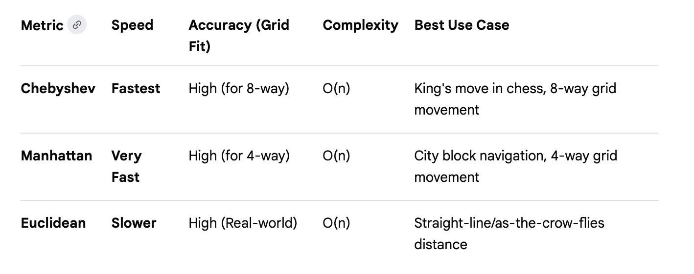

## Distance Algorithms Comparison

Speed & Performance: Chebyshev and Manhattan are generally faster than Euclidean because they rely on simple addition, subtraction, and max() operations. Euclidean requires calculating square roots, which is more computationally expensive.
Accuracy:
- Euclidean is the most accurate for continuous, real-world "shortest path" distances.
- Manhattan provides the most accurate distance for grid systems where you cannot move diagonally.
- Chebyshev is essentially a "chessboard distance" where diagonal and horizontal steps are equivalent in cost, making it the most accurate for those specific constraints.
Complexity: All three algorithms have a time complexity of O(n), where n is the number of dimensions. This means the time taken scales linearly with the number of coordinates being processed. 

